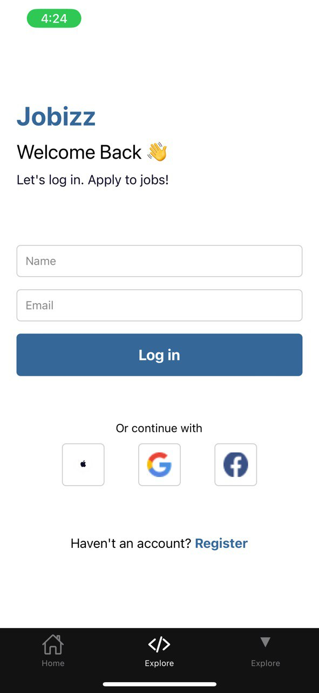
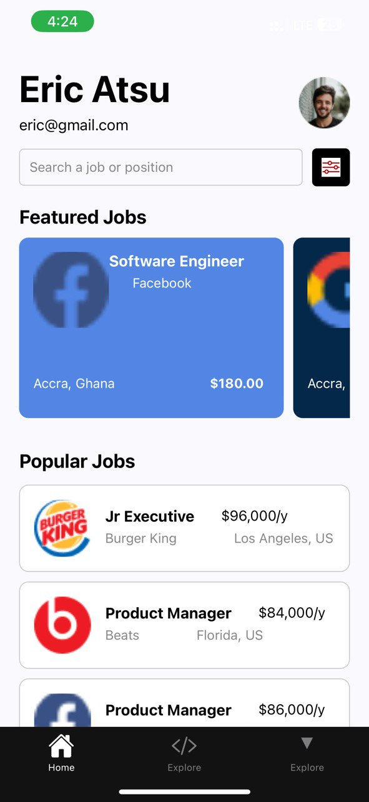

# rn-assignment4-11327734

# Jobizz Login Screen
This React Native component provides a user-friendly login screen for the Jobizz app. Users can log in using their name and email or via social login options (Apple, Google, Facebook).

Components:
**ExploreScreen** : The main component for the login screen. It manages the state of the name and email input fields and handles the login process.
**View**: Used for layout and grouping of other components.
**Text**: Displays text content, including headers, labels, and instructions.
**StyleSheet**: Defines styles for all components, ensuring a consistent and visually appealing look.
**TextInput**: Allows users to input their name and email.
**TouchableOpacity**: Creates interactive buttons that trigger actions when pressed.
**Image**: Displays the social login icons.
# Screenshots:
